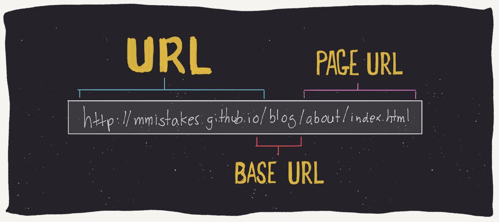

# Affiliates - Free Jekyll Theme
[Live Demo](https://wowthemesnet.github.io/affiliates-jekyll-theme/) | [Docs & Download](https://bootstrapstarter.com/template-affiliates-bootstrap-jekyll/) | 

<!--  -->




In manual below, text in `<ALL CAPS>` are comments FYI. Do not run them. (scripts included)

## To serve and test locally (./run_site.sh)
```
<MAKE SURE IN SOURCE BRANCH>

git checkout source
jekyll serve --watch --port 4001
```

## Page update + multilingual publishing instructions (./publish_site.sh)
```
<STEP 0. SYNC LATEST CODE>

git pull origin source
git pull origin master


<STEP 1. MAKE YOUR WEBSITE CHANGES IN SOURCE BRANCH>

git checkout source
git add --all
git commit -m "your changes messages"

<BUILD YOUR WEBSITE, MAKE SURE IN SOURCE BRANCH>

bundle exec jekyll build


<STEP 2. PUBLISH YOUR UPDATED SITE>

git checkout master

<OPTIONAL, USE TO RESET IF NECESSARY>
ls | grep -v '^_site$' | xargs rm -r

cp -r _site/* .
git add .
git commit -m "Updated site version <X>"
git push origin master
git push origin source
```


## Helpful Git commands
Check which branch (aka version) you're in: `git branch`
File deltas to saved: `git status`
Content deltas to saved: `git diff <FILENAME or LEAVE EMPTY FOR ALL>`